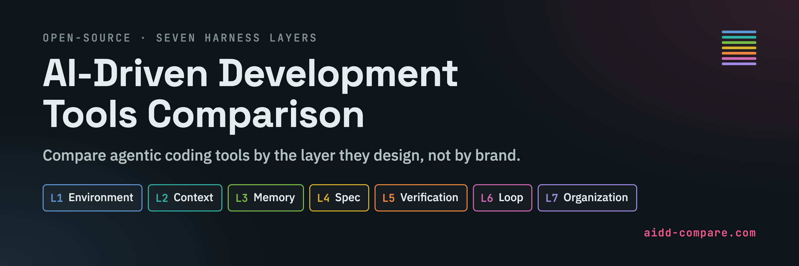

# AI-Driven Development Tools Comparison

An open comparison of open-source AI-driven development tools, organized into seven layers.

Compare what each tool supports, the artifacts it produces, and where it fits your project.

[Open the comparison(aidd-compare.com)](https://aidd-compare.com/) · [日本語](i18n/README.ja.md)

## Getting started

1. Browse the [comparison site](https://aidd-compare.com/) or the [comparison table](docs/comparison.md).
2. Use the [decision guide](docs/decision-guide.md) to find the layer that matches your problem.
3. Check each tool's prerequisites, project fit and reasons not to use it.

## Documentation

| Read | What it answers |
|---|---|
| [Comparison table](docs/comparison.md) | What does each tool do, and where does it fit? |
| [Layers](docs/layers/README.md) | Is the problem about environment, context, memory, specification, verification, iteration or coordination? |
| [Evaluation axes](docs/schema.md) | What do the values mean? |
| [Quality rubric](docs/quality-rubric.md) | What evidence earns each quality grade? |
| [Flows](docs/flows.md) | In what order does each tool organize the work? |
| [Layer and lifecycle coverage](docs/heatmap.md) | Which development stages does each layer support? |
| [Threats and controls](docs/threat-map.md) | Which adoption risks need attention? |
| [Inclusion criteria](CRITERIA.md) | Which tools belong in this comparison? |

## Layer model

| Layer | What it designs |
|---|---|
| L1 | Environment and tools available to the agent |
| L2 | Context supplied to each inference |
| L3 | Memory that survives turns and sessions |
| L4 | Specification of the intended change |
| L5 | Verification and acceptance criteria |
| L6 | Iteration, feedback and stopping conditions |
| L7 | Coordination among agents |

## Evaluation axes

Compare lifecycle support, project fit, quality, token profile, maintenance, workflow and standards support. Security controls and interface capabilities are separate dimensions. [Definitions and field meanings](docs/schema.md) explain how to interpret each value.

## How the comparison works

Each [tool record](data/tools/) contains sources, access dates, prerequisites, anti-fit conditions and assessment values. [Flow evidence](data/flow-evidence/) connects steps to their source files. [Project health](docs/health.md) provides context for maintenance and distribution.

`none` means examined and absent; `not-assessed` means not examined. `conf: check` and `unresolved` identify assessments requiring verification. A documented capability is not the same as an implemented control. Token profiles describe structure; they are not measured costs. Stars indicate attention, not quality.

There is no total score or best-tool ranking. Compare the dimensions that matter to your project. The source dates describe when facts were checked; they are not live measurements.

For data reuse, see the [field guide](docs/schema.md). To report an error or suggest a tool, see [CONTRIBUTING](CONTRIBUTING.md). Original documents and data are licensed under [CC BY 4.0](LICENSE), excluding third-party material. When citing assessments, we recommend including the version or commit and your access date.
