# Workflows

`repo` means a shipped procedure, `readme` means a prose description, and `derived` means the catalogue reconstructs the order. Supporting text matches are evidence to inspect, not proof of correctness. Field meanings are in the [field guide](schema.md#flow-evidence-files).

## AG-UI

Basis: derived. [Tool record](../data/tools/ag-ui-protocol__ag-ui.json) · [Evidence](../data/flow-evidence/ag-ui-protocol__ag-ui.json).

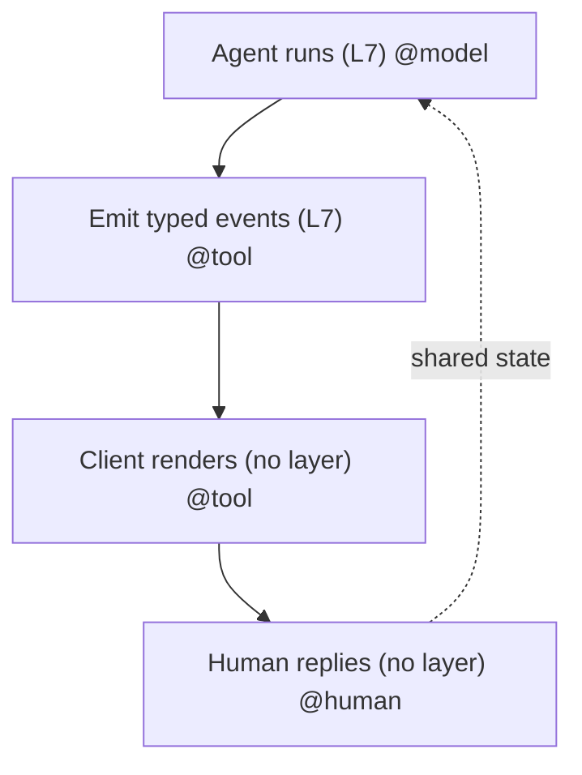
```mermaid
flowchart TD
  s0["Agent runs (L7) @model"]
  s1["Emit typed events (L7) @tool"]
  s0 --> s1
  s2["Client renders (no layer) @tool"]
  s1 --> s2
  s3["Human replies (no layer) @human"]
  s2 --> s3
  s3 -.->|"shared state"| s0
```

## drawio-skill

Basis: repo. [Tool record](../data/tools/agents365-ai__drawio-skill.json) · [Evidence](../data/flow-evidence/agents365-ai__drawio-skill.json).

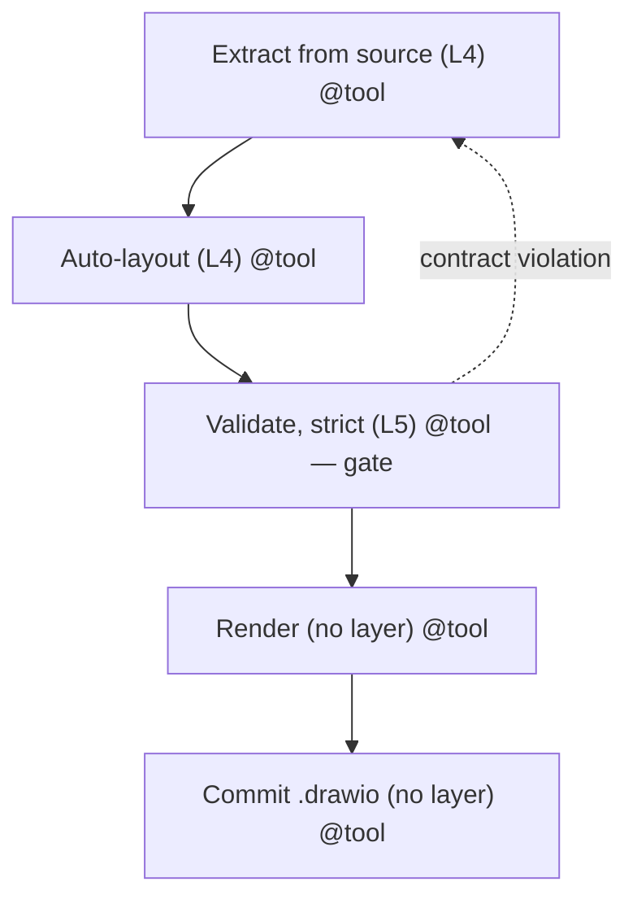
```mermaid
flowchart TD
  s0["Extract from source (L4) @tool"]
  s1["Auto-layout (L4) @tool"]
  s0 --> s1
  s2["Validate, strict (L5) @tool — gate"]
  s1 --> s2
  s3["Render (no layer) @tool"]
  s2 --> s3
  s4["Commit .drawio (no layer) @tool"]
  s3 --> s4
  s2 -.->|"contract violation"| s0
```

## AGENTS.md

Basis: derived. [Tool record](../data/tools/agentsmd__agents.md.json) · [Evidence](../data/flow-evidence/agentsmd__agents.md.json).

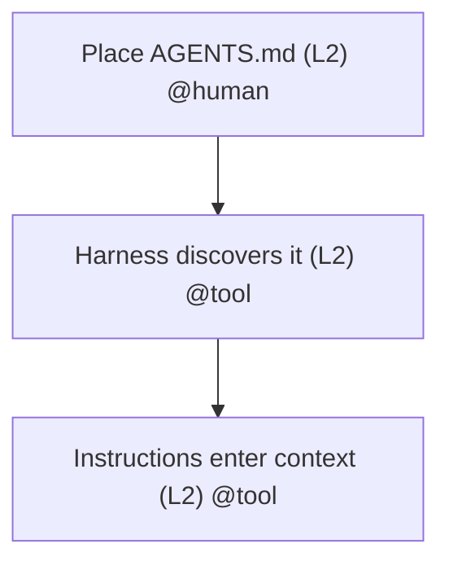
```mermaid
flowchart TD
  s0["Place AGENTS.md (L2) @human"]
  s1["Harness discovers it (L2) @tool"]
  s0 --> s1
  s2["Instructions enter context (L2) @tool"]
  s1 --> s2
```

## AI-DLC Workflows

Basis: repo. [Tool record](../data/tools/awslabs__aidlc-workflows.json) · [Evidence](../data/flow-evidence/awslabs__aidlc-workflows.json).

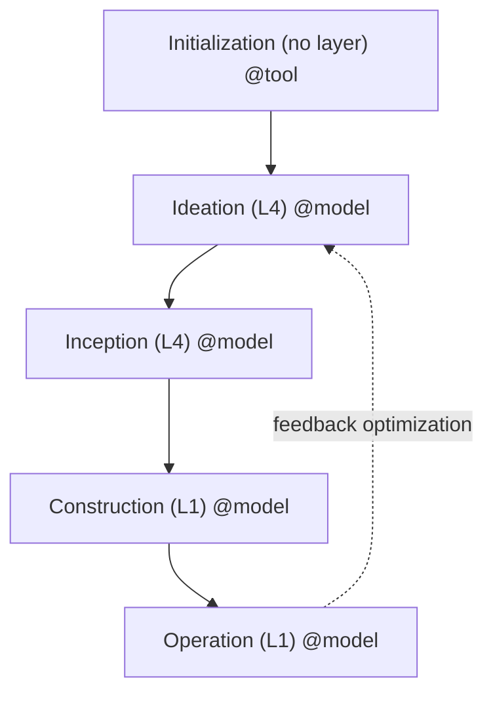
```mermaid
flowchart TD
  s0["Initialization (no layer) @tool"]
  s1["Ideation (L4) @model"]
  s0 --> s1
  s2["Inception (L4) @model"]
  s1 --> s2
  s3["Construction (L1) @model"]
  s2 --> s3
  s4["Operation (L1) @model"]
  s3 --> s4
  s4 -.->|"feedback optimization"| s1
```

## CLI Agent Orchestrator (CAO)

Basis: repo. [Tool record](../data/tools/awslabs__cli-agent-orchestrator.json) · [Evidence](../data/flow-evidence/awslabs__cli-agent-orchestrator.json).

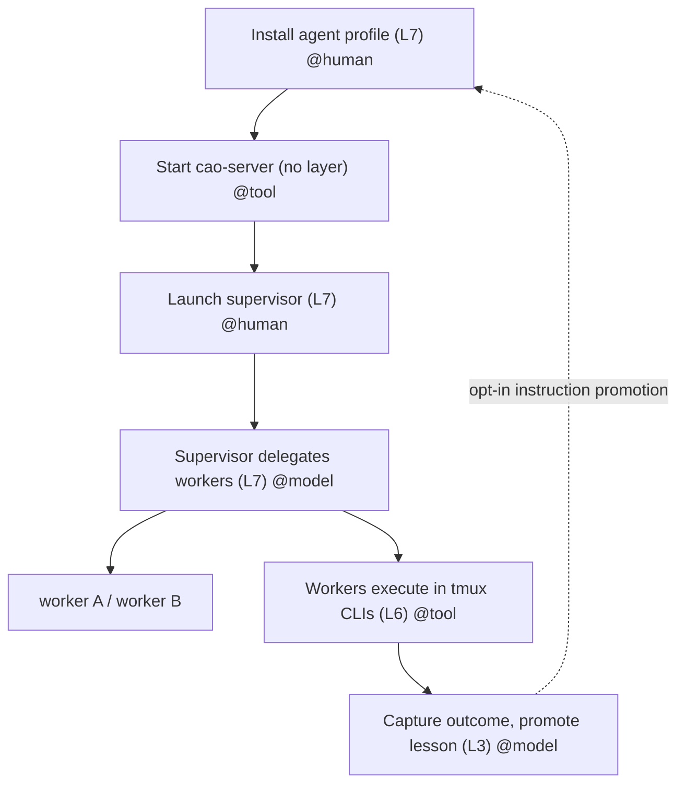
```mermaid
flowchart TD
  s0["Install agent profile (L7) @human"]
  s1["Start cao-server (no layer) @tool"]
  s0 --> s1
  s2["Launch supervisor (L7) @human"]
  s1 --> s2
  s3["Supervisor delegates workers (L7) @model"]
  s2 --> s3
  s3 --> p3["worker A / worker B"]
  s4["Workers execute in tmux CLIs (L6) @tool"]
  s3 --> s4
  s5["Capture outcome, promote lesson (L3) @model"]
  s4 --> s5
  s5 -.->|"opt-in instruction promotion"| s0
```

## MemoryOS

Basis: readme. [Tool record](../data/tools/bai-lab__memoryos.json) · [Evidence](../data/flow-evidence/bai-lab__memoryos.json).

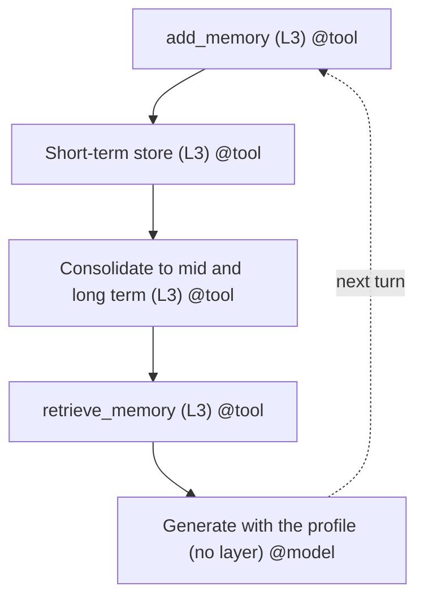
```mermaid
flowchart TD
  s0["add_memory (L3) @tool"]
  s1["Short-term store (L3) @tool"]
  s0 --> s1
  s2["Consolidate to mid and long term (L3) @tool"]
  s1 --> s2
  s3["retrieve_memory (L3) @tool"]
  s2 --> s3
  s4["Generate with the profile (no layer) @model"]
  s3 --> s4
  s4 -.->|"next turn"| s0
```

## Basic Memory

Basis: derived. [Tool record](../data/tools/basicmachines-co__basic-memory.json) · [Evidence](../data/flow-evidence/basicmachines-co__basic-memory.json).

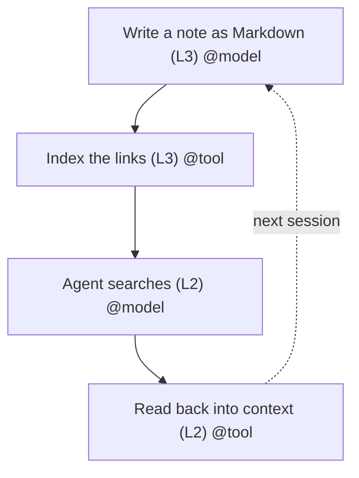
```mermaid
flowchart TD
  s0["Write a note as Markdown (L3) @model"]
  s1["Index the links (L3) @tool"]
  s0 --> s1
  s2["Agent searches (L2) @model"]
  s1 --> s2
  s3["Read back into context (L2) @tool"]
  s2 --> s3
  s3 -.->|"next session"| s0
```

## agent-lsp

Basis: repo. [Tool record](../data/tools/blackwell-systems__agent-lsp.json) · [Evidence](../data/flow-evidence/blackwell-systems__agent-lsp.json).

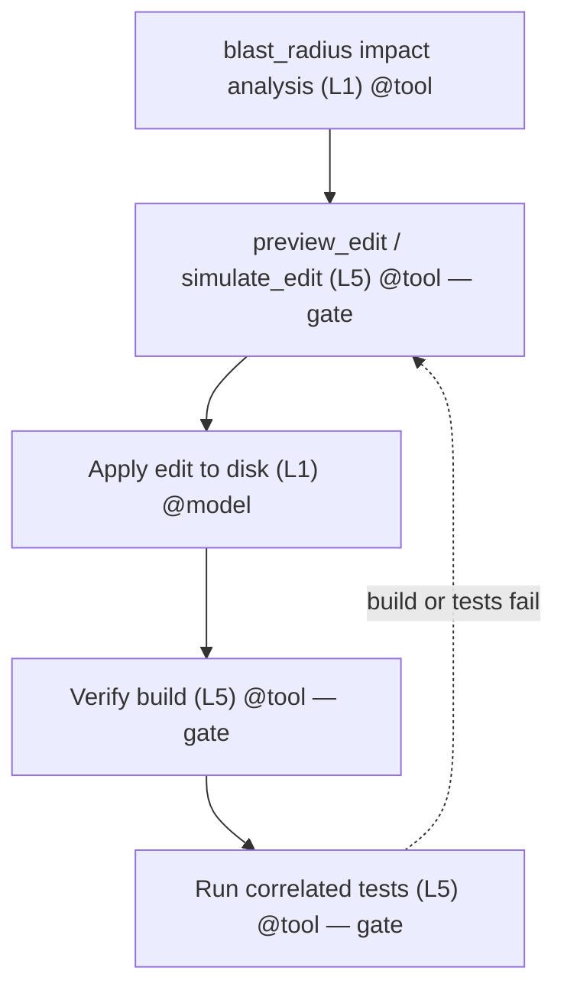
```mermaid
flowchart TD
  s0["blast_radius impact analysis (L1) @tool"]
  s1["preview_edit / simulate_edit (L5) @tool — gate"]
  s0 --> s1
  s2["Apply edit to disk (L1) @model"]
  s1 --> s2
  s3["Verify build (L5) @tool — gate"]
  s2 --> s3
  s4["Run correlated tests (L5) @tool — gate"]
  s3 --> s4
  s4 -.->|"build or tests fail"| s1
```

## BMAD-METHOD

Basis: repo. [Tool record](../data/tools/bmad-code-org__bmad-method.json) · [Evidence](../data/flow-evidence/bmad-code-org__bmad-method.json).

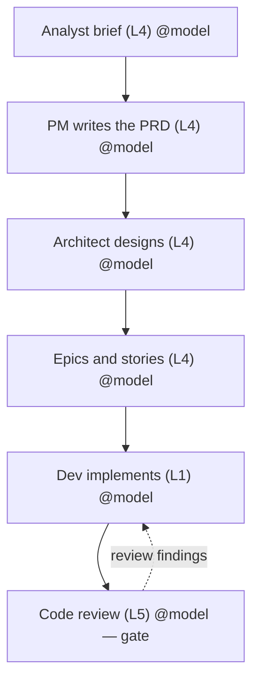
```mermaid
flowchart TD
  s0["Analyst brief (L4) @model"]
  s1["PM writes the PRD (L4) @model"]
  s0 --> s1
  s2["Architect designs (L4) @model"]
  s1 --> s2
  s3["Epics and stories (L4) @model"]
  s2 --> s3
  s4["Dev implements (L1) @model"]
  s3 --> s4
  s5["Code review (L5) @model — gate"]
  s4 --> s5
  s5 -.->|"review findings"| s4
```

## Browser Use

Basis: repo. [Tool record](../data/tools/browser-use__browser-use.json) · [Evidence](../data/flow-evidence/browser-use__browser-use.json).

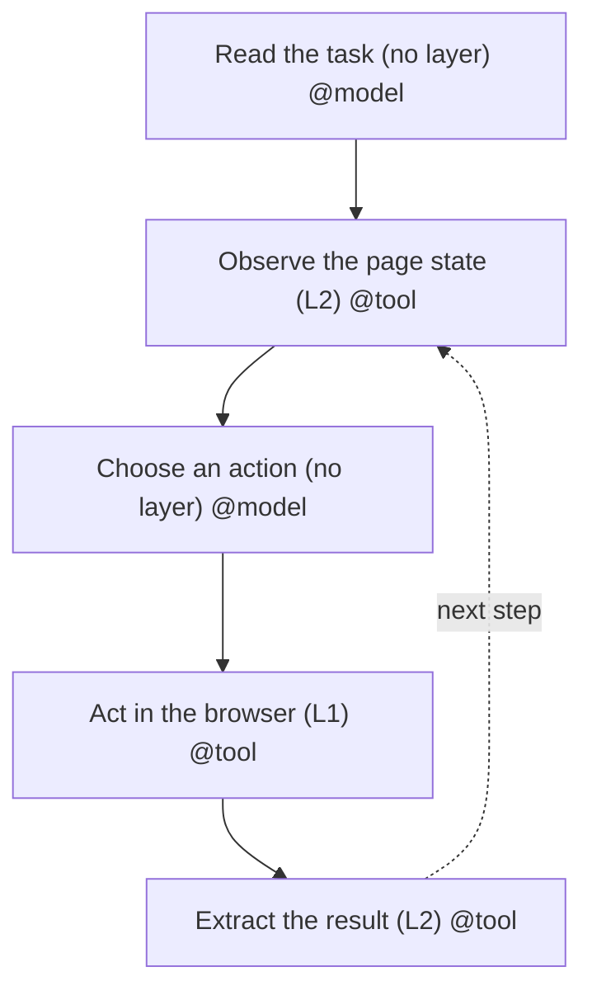
```mermaid
flowchart TD
  s0["Read the task (no layer) @model"]
  s1["Observe the page state (L2) @tool"]
  s0 --> s1
  s2["Choose an action (no layer) @model"]
  s1 --> s2
  s3["Act in the browser (L1) @tool"]
  s2 --> s3
  s4["Extract the result (L2) @tool"]
  s3 --> s4
  s4 -.->|"next step"| s1
```

## DeerFlow

Basis: repo. [Tool record](../data/tools/bytedance__deer-flow.json) · [Evidence](../data/flow-evidence/bytedance__deer-flow.json).

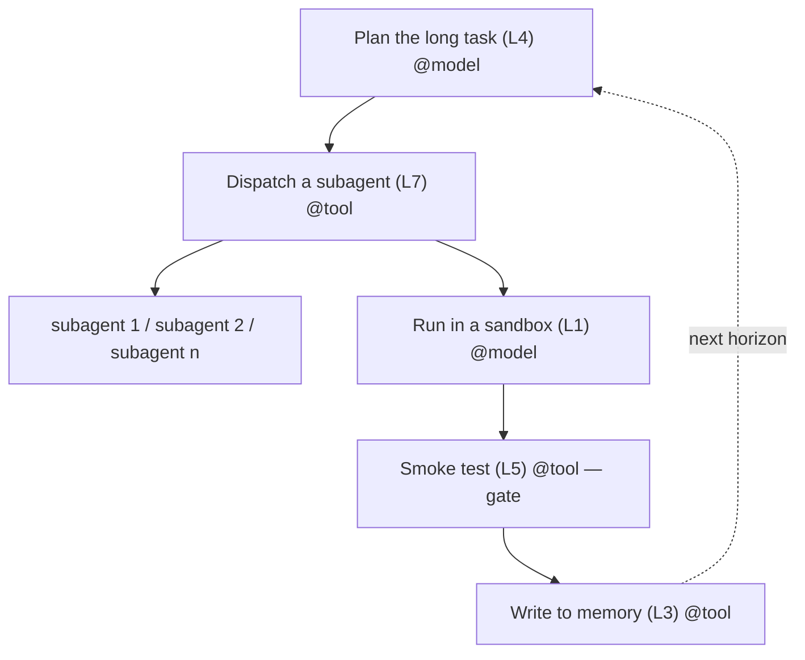
```mermaid
flowchart TD
  s0["Plan the long task (L4) @model"]
  s1["Dispatch a subagent (L7) @tool"]
  s0 --> s1
  s1 --> p1["subagent 1 / subagent 2 / subagent n"]
  s2["Run in a sandbox (L1) @model"]
  s1 --> s2
  s3["Smoke test (L5) @tool — gate"]
  s2 --> s3
  s4["Write to memory (L3) @tool"]
  s3 --> s4
  s4 -.->|"next horizon"| s0
```

## Loop Engineering

Basis: repo. [Tool record](../data/tools/cobusgreyling__loop-engineering.json) · [Evidence](../data/flow-evidence/cobusgreyling__loop-engineering.json).

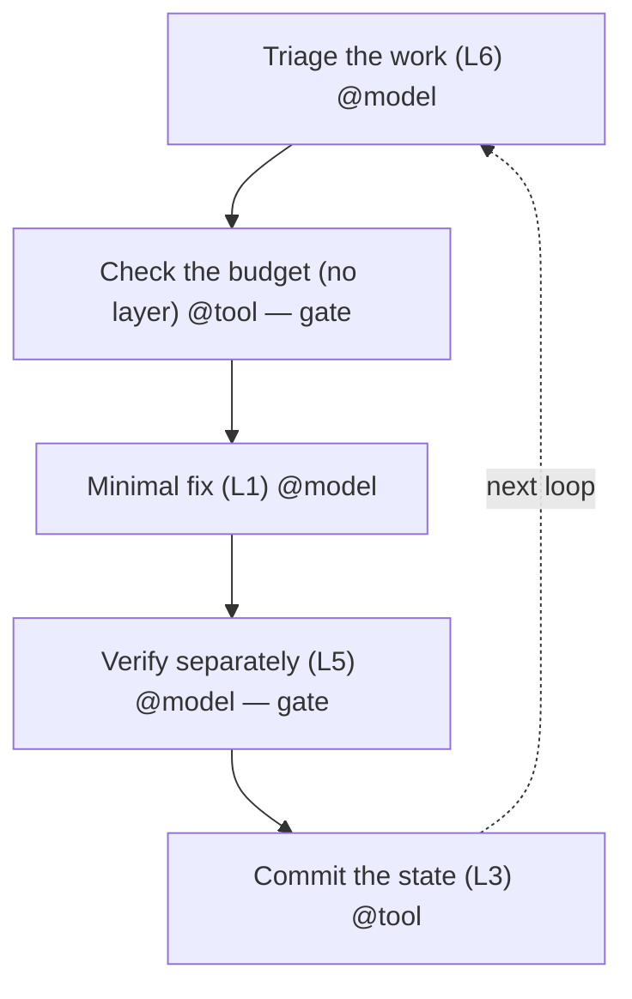
```mermaid
flowchart TD
  s0["Triage the work (L6) @model"]
  s1["Check the budget (no layer) @tool — gate"]
  s0 --> s1
  s2["Minimal fix (L1) @model"]
  s1 --> s2
  s3["Verify separately (L5) @model — gate"]
  s2 --> s3
  s4["Commit the state (L3) @tool"]
  s3 --> s4
  s4 -.->|"next loop"| s0
```

## CodeGraph

Basis: readme. [Tool record](../data/tools/colbymchenry__codegraph.json) · [Evidence](../data/flow-evidence/colbymchenry__codegraph.json).

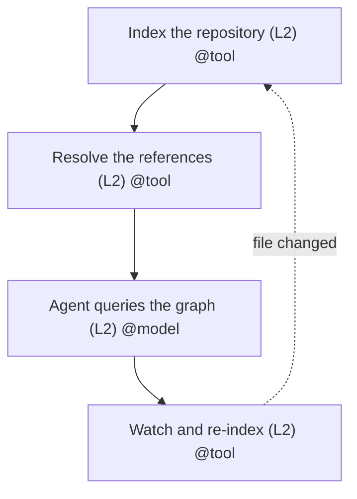
```mermaid
flowchart TD
  s0["Index the repository (L2) @tool"]
  s1["Resolve the references (L2) @tool"]
  s0 --> s1
  s2["Agent queries the graph (L2) @model"]
  s1 --> s2
  s3["Watch and re-index (L2) @tool"]
  s2 --> s3
  s3 -.->|"file changed"| s0
```

## Opik

Basis: derived. [Tool record](../data/tools/comet-ml__opik.json) · [Evidence](../data/flow-evidence/comet-ml__opik.json).

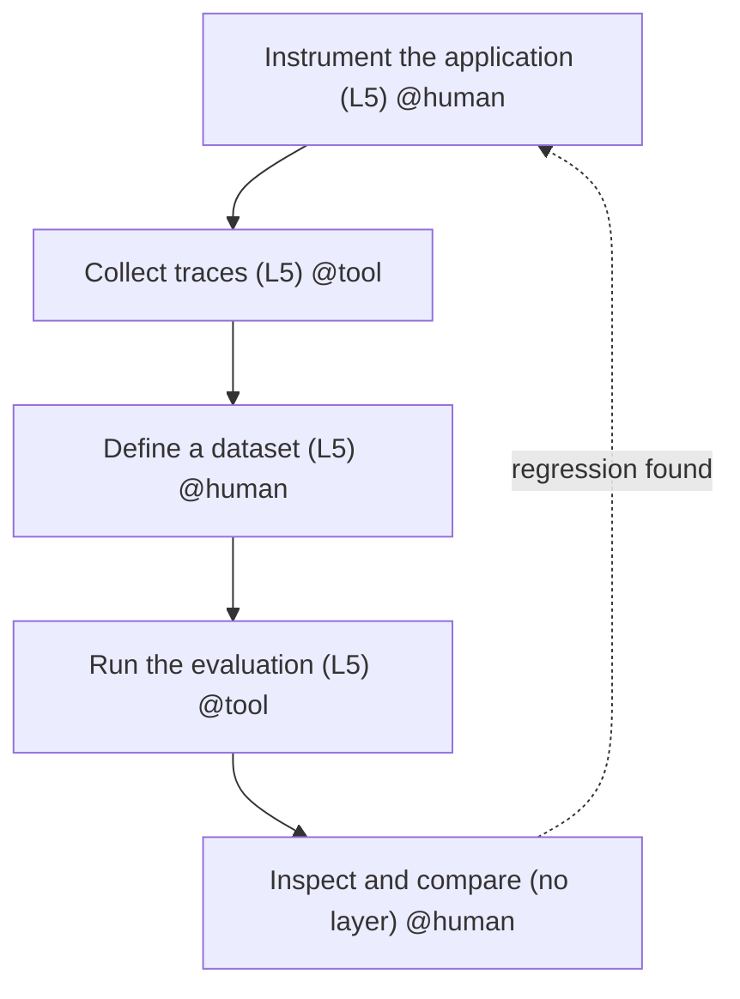
```mermaid
flowchart TD
  s0["Instrument the application (L5) @human"]
  s1["Collect traces (L5) @tool"]
  s0 --> s1
  s2["Define a dataset (L5) @human"]
  s1 --> s2
  s3["Run the evaluation (L5) @tool"]
  s2 --> s3
  s4["Inspect and compare (no layer) @human"]
  s3 --> s4
  s4 -.->|"regression found"| s0
```

## DeepEval

Basis: derived. [Tool record](../data/tools/confident-ai__deepeval.json) · [Evidence](../data/flow-evidence/confident-ai__deepeval.json).

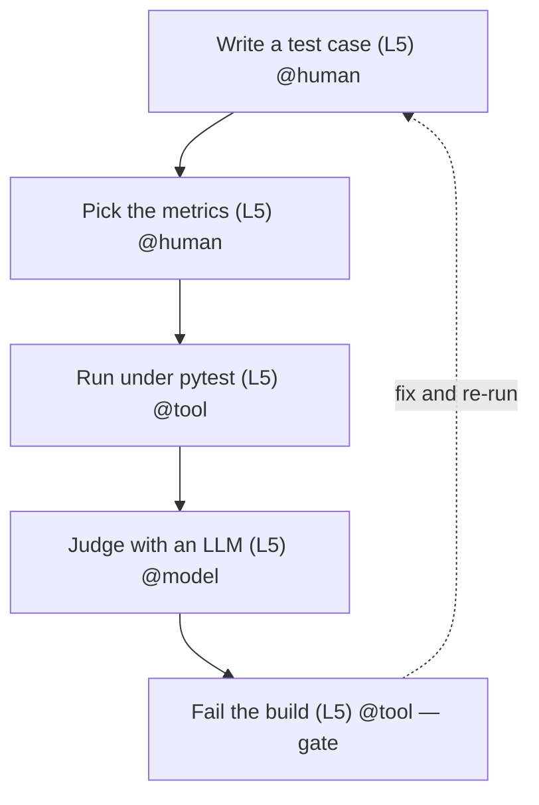
```mermaid
flowchart TD
  s0["Write a test case (L5) @human"]
  s1["Pick the metrics (L5) @human"]
  s0 --> s1
  s2["Run under pytest (L5) @tool"]
  s1 --> s2
  s3["Judge with an LLM (L5) @model"]
  s2 --> s3
  s4["Fail the build (L5) @tool — gate"]
  s3 --> s4
  s4 -.->|"fix and re-run"| s0
```

## Coze Loop

Basis: derived. [Tool record](../data/tools/coze-dev__coze-loop.json) · [Evidence](../data/flow-evidence/coze-dev__coze-loop.json).

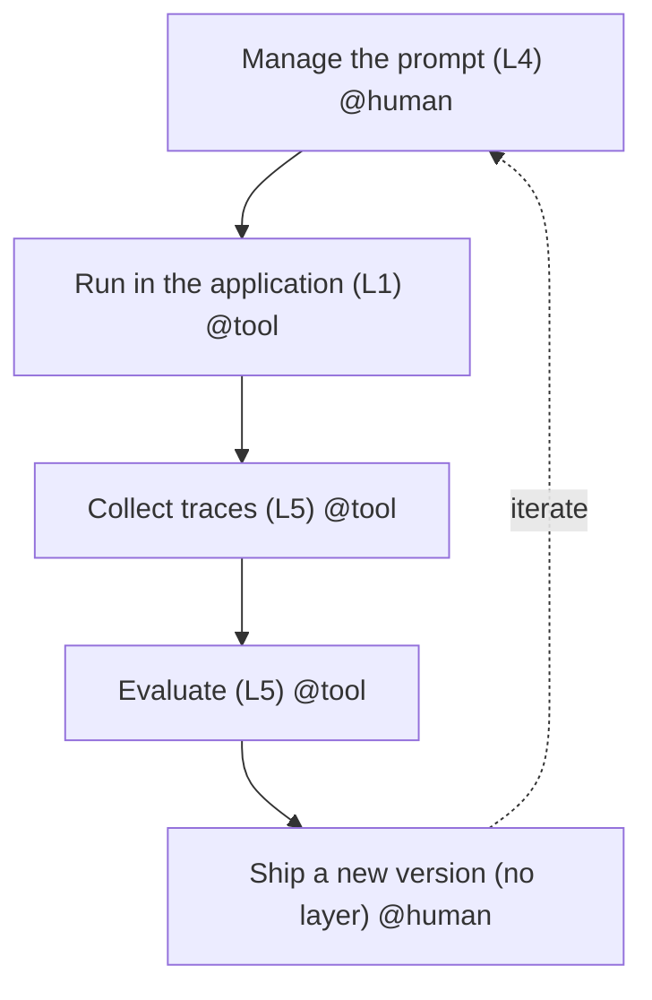
```mermaid
flowchart TD
  s0["Manage the prompt (L4) @human"]
  s1["Run in the application (L1) @tool"]
  s0 --> s1
  s2["Collect traces (L5) @tool"]
  s1 --> s2
  s3["Evaluate (L5) @tool"]
  s2 --> s3
  s4["Ship a new version (no layer) @human"]
  s3 --> s4
  s4 -.->|"iterate"| s0
```

## CrewAI

Basis: repo. [Tool record](../data/tools/crewaiinc__crewai.json) · [Evidence](../data/flow-evidence/crewaiinc__crewai.json).

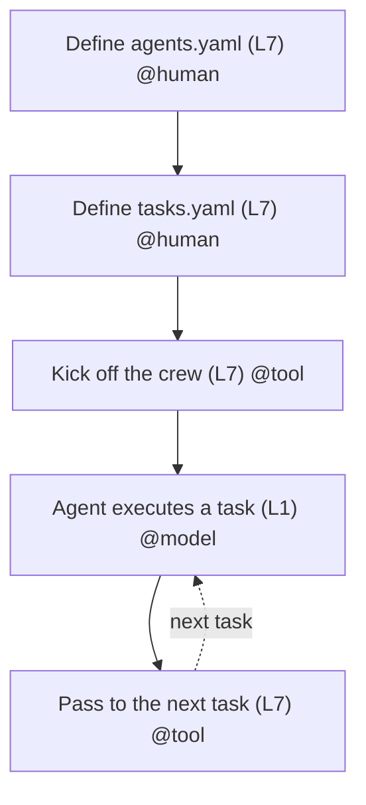
```mermaid
flowchart TD
  s0["Define agents.yaml (L7) @human"]
  s1["Define tasks.yaml (L7) @human"]
  s0 --> s1
  s2["Kick off the crew (L7) @tool"]
  s1 --> s2
  s3["Agent executes a task (L1) @model"]
  s2 --> s3
  s4["Pass to the next task (L7) @tool"]
  s3 --> s4
  s4 -.->|"next task"| s3
```

## container-use

Basis: repo. [Tool record](../data/tools/dagger__container-use.json) · [Evidence](../data/flow-evidence/dagger__container-use.json).

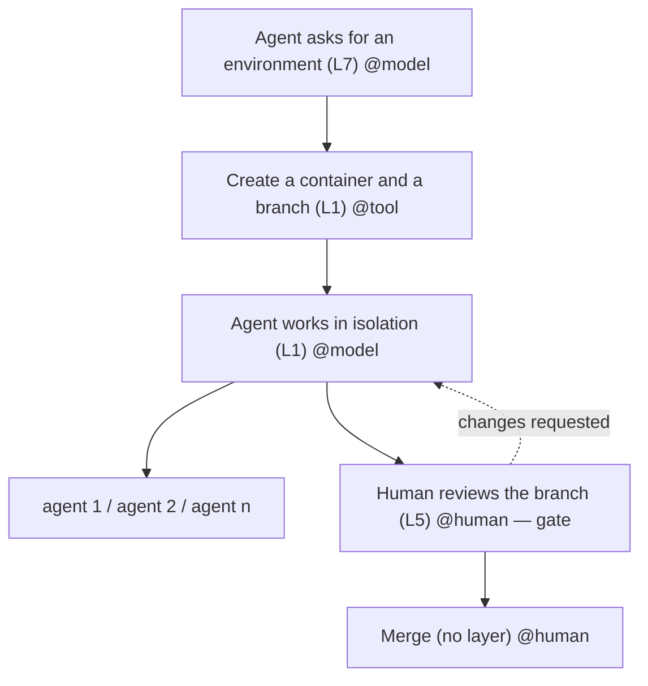
```mermaid
flowchart TD
  s0["Agent asks for an environment (L7) @model"]
  s1["Create a container and a branch (L1) @tool"]
  s0 --> s1
  s2["Agent works in isolation (L1) @model"]
  s1 --> s2
  s2 --> p2["agent 1 / agent 2 / agent n"]
  s3["Human reviews the branch (L5) @human — gate"]
  s2 --> s3
  s4["Merge (no layer) @human"]
  s3 --> s4
  s3 -.->|"changes requested"| s2
```

## .NET Agent Skills

Basis: repo. [Tool record](../data/tools/dotnet__skills.json) · [Evidence](../data/flow-evidence/dotnet__skills.json).

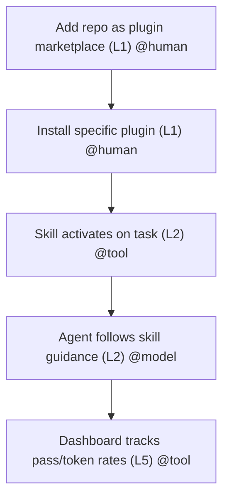
```mermaid
flowchart TD
  s0["Add repo as plugin marketplace (L1) @human"]
  s1["Install specific plugin (L1) @human"]
  s0 --> s1
  s2["Skill activates on task (L2) @tool"]
  s1 --> s2
  s3["Agent follows skill guidance (L2) @model"]
  s2 --> s3
  s4["Dashboard tracks pass/token rates (L5) @tool"]
  s3 --> s4
```

## snip

Basis: readme. [Tool record](../data/tools/edouard-claude__snip.json) · [Evidence](../data/flow-evidence/edouard-claude__snip.json).

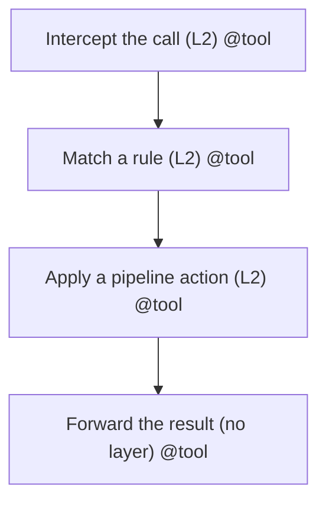
```mermaid
flowchart TD
  s0["Intercept the call (L2) @tool"]
  s1["Match a rule (L2) @tool"]
  s0 --> s1
  s2["Apply a pipeline action (L2) @tool"]
  s1 --> s2
  s3["Forward the result (no layer) @tool"]
  s2 --> s3
```

## OpenSpec

Basis: repo. [Tool record](../data/tools/fission-ai__openspec.json) · [Evidence](../data/flow-evidence/fission-ai__openspec.json).

```mermaid
flowchart TD
  s0["Proposal (L4) @model"]
  s1["Spec deltas (L4) @model"]
  s0 --> s1
  s2["Design (L4) @model"]
  s1 --> s2
  s3["Tasks (L4) @model"]
  s2 --> s3
  s4["Implement (L1) @model"]
  s3 --> s4
  s5["Archive into the spec (L3) @tool"]
  s4 --> s5
  s4 -.->|"task not done"| s3
```

## Ralph for Claude Code

Basis: readme. [Tool record](../data/tools/frankbria__ralph-claude-code.json) · [Evidence](../data/flow-evidence/frankbria__ralph-claude-code.json).

```mermaid
flowchart TD
  s0["Read PROMPT.md (L2) @tool"]
  s1["Run the agent (L1) @model"]
  s0 --> s1
  s2["Check the exit condition (L6) @tool — gate"]
  s1 --> s2
  s3["Rate-limit guard (L1) @tool"]
  s2 --> s3
  s4["Update fix_plan.md (L3) @model"]
  s3 --> s4
  s4 -.->|"loop again"| s0
```

## Beads

Basis: repo. [Tool record](../data/tools/gastownhall__beads.json) · [Evidence](../data/flow-evidence/gastownhall__beads.json).

```mermaid
flowchart TD
  s0["bd create (L3) @model"]
  s1["Dependency graph (L3) @tool"]
  s0 --> s1
  s2["bd ready (L3) @tool"]
  s1 --> s2
  s3["Agent claims it (L7) @model"]
  s2 --> s3
  s4["bd close (L3) @model"]
  s3 --> s4
  s4 -.->|"blockers released"| s2
```

## Graphiti

Basis: derived. [Tool record](../data/tools/getzep__graphiti.json) · [Evidence](../data/flow-evidence/getzep__graphiti.json).

```mermaid
flowchart TD
  s0["Ingest an episode (L3) @tool"]
  s1["Extract entities and edges (L3) @model"]
  s0 --> s1
  s2["Set the validity window (L3) @tool"]
  s1 --> s2
  s3["Invalidate contradicted facts (L3) @tool"]
  s2 --> s3
  s4["Query at a point in time (L2) @tool"]
  s3 --> s4
  s4 -.->|"new episode"| s0
```

## Ralph Loop (pattern)

Basis: derived. [Tool record](../data/tools/ghuntley.com__ralph.json) · [Evidence](../data/flow-evidence/ghuntley.com__ralph.json).

```mermaid
flowchart TD
  s0["One prompt file (L2) @human"]
  s1["Run the agent (L1) @model"]
  s0 --> s1
  s2["Agent picks the next task (L6) @model"]
  s1 --> s2
  s3["Loop again (L6) @tool"]
  s2 --> s3
  s3 -.->|"until done"| s0
```

## gh-aw

Basis: repo. [Tool record](../data/tools/github__gh-aw.json) · [Evidence](../data/flow-evidence/github__gh-aw.json).

```mermaid
flowchart TD
  s0["Author Markdown + frontmatter (L4) @human"]
  s1["gh aw compile to .lock.yml (L1) @tool"]
  s0 --> s1
  s2["GitHub event triggers workflow (L6) @tool"]
  s1 --> s2
  s3["Read-only sandboxed agent job runs (L1) @model"]
  s2 --> s3
  s4["Safe-outputs job validates writes (L5) @tool — gate"]
  s3 --> s4
  s5["Human reviews comment/issue/PR (L5) @human — gate"]
  s4 --> s5
```

## GitHub Spec-Kit

Basis: repo. [Tool record](../data/tools/github__spec-kit.json) · [Evidence](../data/flow-evidence/github__spec-kit.json).

```mermaid
flowchart TD
  s0["Constitution (L4) @human"]
  s1["Specify (L4) @model"]
  s0 --> s1
  s2["Plan (L4) @model"]
  s1 --> s2
  s3["Tasks (L4) @model"]
  s2 --> s3
  s4["Implement (L1) @model"]
  s3 --> s4
  s4 -.->|"task fails"| s3
```

## Framelink Figma MCP

Basis: readme. [Tool record](../data/tools/glips__figma-context-mcp.json) · [Evidence](../data/flow-evidence/glips__figma-context-mcp.json).

```mermaid
flowchart TD
  s0["Agent asks for a frame (L2) @model"]
  s1["Fetch the Figma API (L1) @tool"]
  s0 --> s1
  s2["Simplify the response (L2) @tool"]
  s1 --> s2
  s3["Return layout data (L2) @tool"]
  s2 --> s3
```

## DESIGN.md

Basis: derived. [Tool record](../data/tools/google-labs-code__design-md.json) · [Evidence](../data/flow-evidence/google-labs-code__design-md.json).

```mermaid
flowchart TD
  s0["Write DESIGN.md (L4) @human"]
  s1["Declare tokens in front matter (L4) @human"]
  s0 --> s1
  s2["Validate references and contrast (L5) @tool — gate"]
  s1 --> s2
  s3["Agent builds the UI from tokens (L1) @model"]
  s2 --> s3
  s2 -.->|"contrast failure"| s0
```

## cc-sdd

Basis: readme. [Tool record](../data/tools/gotalab__cc-sdd.json) · [Evidence](../data/flow-evidence/gotalab__cc-sdd.json).

```mermaid
flowchart TD
  s0["Requirements (L4) @model"]
  s1["Human approves (L5) @human — gate"]
  s0 --> s1
  s2["Design (L4) @model"]
  s1 --> s2
  s3["Human approves (L5) @human — gate"]
  s2 --> s3
  s4["Tasks (L4) @model"]
  s3 --> s4
  s5["Implement (L1) @model"]
  s4 --> s5
  s1 -.->|"rejected"| s0
  s3 -.->|"rejected"| s2
```

## hol-guard

Basis: repo. [Tool record](../data/tools/hashgraph-online__hol-guard.json) · [Evidence](../data/flow-evidence/hashgraph-online__hol-guard.json).

```mermaid
flowchart TD
  s0["hol-guard init (L1) @human"]
  s1["Guard installs harness hook (L1) @tool"]
  s0 --> s1
  s2["Agent issues tool call (L1) @model"]
  s1 --> s2
  s3["Guard evaluates policy (L5) @tool — gate"]
  s2 --> s3
  s4["Human approves or denies (L5) @human — gate"]
  s3 --> s4
  s5["Receipt recorded (L5) @tool"]
  s4 --> s5
  s5 -.->|"next tool call"| s2
```

## Headroom

Basis: readme. [Tool record](../data/tools/headroomlabs-ai__headroom.json) · [Evidence](../data/flow-evidence/headroomlabs-ai__headroom.json).

```mermaid
flowchart TD
  s0["Input received (L2) @tool"]
  s1["Cache aligner (L2) @tool"]
  s0 --> s1
  s2["Content router (L2) @tool"]
  s1 --> s2
  s3["Compress (L2) @tool"]
  s2 --> s3
  s4["Remember (L3) @tool"]
  s3 --> s4
```

## judgeval

Basis: derived. [Tool record](../data/tools/judgmentlabs__judgeval.json) · [Evidence](../data/flow-evidence/judgmentlabs__judgeval.json).

```mermaid
flowchart TD
  s0["Instrument with OpenTelemetry (L5) @human"]
  s1["Capture the trace (L5) @tool"]
  s0 --> s1
  s2["Score with prompt judges (L5) @model"]
  s1 --> s2
  s3["Trace a failure to its cause (L5) @human"]
  s2 --> s3
  s4["Keep it as a regression case (L5) @tool"]
  s3 --> s4
  s4 -.->|"validate the fix"| s0
```

## Swarms

Basis: readme. [Tool record](../data/tools/kyegomez__swarms.json) · [Evidence](../data/flow-evidence/kyegomez__swarms.json).

```mermaid
flowchart TD
  s0["Pick an architecture (L7) @human"]
  s1["Assign the agents (L7) @human"]
  s0 --> s1
  s2["Run sequential or concurrent (L7) @model"]
  s1 --> s2
  s3["Aggregate the output (no layer) @tool"]
  s2 --> s3
  s3 -.->|"iterative refinement"| s2
```

## Langfuse

Basis: derived. [Tool record](../data/tools/langfuse__langfuse.json) · [Evidence](../data/flow-evidence/langfuse__langfuse.json).

```mermaid
flowchart TD
  s0["Wrap the LLM call (L5) @human"]
  s1["Record the trace and the cost (L5) @tool"]
  s0 --> s1
  s2["Build a dataset from traces (L5) @human"]
  s1 --> s2
  s3["Run an evaluation (L5) @tool"]
  s2 --> s3
  s4["Compare versions (no layer) @human"]
  s3 --> s4
  s4 -.->|"next release"| s0
```

## Letta Code

Basis: repo. [Tool record](../data/tools/letta-ai__letta-code.json) · [Evidence](../data/flow-evidence/letta-ai__letta-code.json).

```mermaid
flowchart TD
  s0["Load the agent state (L3) @tool"]
  s1["Model turn (no layer) @model"]
  s0 --> s1
  s2["Rewrite its own memory (L3) @model"]
  s1 --> s2
  s3["Commit MemFS to git (L3) @tool"]
  s2 --> s3
  s4["Resume anywhere (no layer) @tool"]
  s3 --> s4
  s3 -.->|"next turn"| s1
```

## Skills for Real Engineers

Basis: repo. [Tool record](../data/tools/mattpocock__skills.json) · [Evidence](../data/flow-evidence/mattpocock__skills.json).

```mermaid
flowchart TD
  s0["Install the skills as source (L2) @human"]
  s1["A skill activates on the task (L2) @tool"]
  s0 --> s1
  s2["Domain modeling or design (L4) @model"]
  s1 --> s2
  s3["TDD (L5) @model"]
  s2 --> s3
  s4["Code review (L5) @model — gate"]
  s3 --> s4
  s4 -.->|"review findings"| s3
```

## mem0

Basis: repo. [Tool record](../data/tools/mem0ai__mem0.json) · [Evidence](../data/flow-evidence/mem0ai__mem0.json).

```mermaid
flowchart TD
  s0["Observe the conversation (L3) @tool"]
  s1["Extract the facts (L3) @model"]
  s0 --> s1
  s2["Resolve conflicts (L3) @model"]
  s1 --> s2
  s3["Store (L3) @tool"]
  s2 --> s3
  s4["Search on the next turn (L2) @tool"]
  s3 --> s4
  s4 -.->|"next turn"| s0
```

## MemPalace

Basis: repo. [Tool record](../data/tools/mempalace__mempalace.json) · [Evidence](../data/flow-evidence/mempalace__mempalace.json).

```mermaid
flowchart TD
  s0["init the palace (L3) @tool"]
  s1["mine the history verbatim (L3) @tool"]
  s0 --> s1
  s2["Chunk into drawers (L3) @tool"]
  s1 --> s2
  s3["search locally (L2) @tool"]
  s2 --> s3
  s4["Recall into context (L2) @tool"]
  s3 --> s4
  s4 -.->|"next query"| s3
```

## MemOS

Basis: derived. [Tool record](../data/tools/memtensor__memos.json) · [Evidence](../data/flow-evidence/memtensor__memos.json).

```mermaid
flowchart TD
  s0["add (L3) @tool"]
  s1["Build the graph (L3) @model"]
  s0 --> s1
  s2["retrieve (L2) @tool"]
  s1 --> s2
  s3["edit or delete (L3) @human"]
  s2 --> s3
  s4["Human inspects (no layer) @human"]
  s3 --> s4
  s4 -.->|"correct the graph"| s1
```

## MoAI-ADK

Basis: repo. [Tool record](../data/tools/modu-ai__moai-adk.json) · [Evidence](../data/flow-evidence/modu-ai__moai-adk.json).

```mermaid
flowchart TD
  s0["plan, write the SPEC (L4) @model"]
  s1["plan-auditor (L5) @model — gate"]
  s0 --> s1
  s2["run, TDD (L1) @model"]
  s1 --> s2
  s3["sync-auditor (L5) @model — gate"]
  s2 --> s3
  s4["sync, docs and PR (no layer) @model"]
  s3 --> s4
  s1 -.->|"DEBT"| s0
  s3 -.->|"DEBT"| s2
```

## Nimbalyst

Basis: repo. [Tool record](../data/tools/nimbalyst__nimbalyst.json) · [Evidence](../data/flow-evidence/nimbalyst__nimbalyst.json).

```mermaid
flowchart TD
  s0["Create or open a document (L4) @human"]
  s1["Write in markdown (no layer) @human"]
  s0 --> s1
  s2["Use the AI assistant (L1) @model"]
  s1 --> s2
  s3["Accept/reject AI changes (L5) @human — gate"]
  s2 --> s3
  s4["Work in Agent Manager (L7) @human"]
  s3 --> s4
  s4 --> p4["session A / session B"]
  s5["Search/resume sessions (L7) @tool"]
  s4 --> s5
  s3 -.->|"changes rejected"| s2
```

## TDD Guard

Basis: derived. [Tool record](../data/tools/nizos__tdd-guard.json) · [Evidence](../data/flow-evidence/nizos__tdd-guard.json).

```mermaid
flowchart TD
  s0["Agent tries to edit (no layer) @model"]
  s1["Hook intercepts (L5) @tool"]
  s0 --> s1
  s2["Validate against the test state (L5) @tool"]
  s1 --> s2
  s3["Block or allow (L5) @tool — gate"]
  s2 --> s3
  s4["Write the test first (L5) @model"]
  s3 --> s4
  s4 -.->|"retry the edit"| s0
```

## SkillSpector

Basis: repo. [Tool record](../data/tools/nvidia__skillspector.json) · [Evidence](../data/flow-evidence/nvidia__skillspector.json).

```mermaid
flowchart TD
  s0["resolve_input (L2) @tool"]
  s1["build_context (L2) @tool"]
  s0 --> s1
  s2["Analyzers in parallel (L5) @tool"]
  s1 --> s2
  s2 --> p2["static / behavioural / mcp / semantic"]
  s3["meta_analyzer (L5) @model"]
  s2 --> s3
  s4["SAFE / CAUTION / DO_NOT_INSTALL (L5) @tool — gate"]
  s3 --> s4
```

## Superpowers

Basis: repo. [Tool record](../data/tools/obra__superpowers.json) · [Evidence](../data/flow-evidence/obra__superpowers.json).

```mermaid
flowchart TD
  s0["Brainstorm (L4) @model"]
  s1["Write the plan (L4) @model"]
  s0 --> s1
  s2["Subagent TDD (L5) @model"]
  s1 --> s2
  s2 --> p2["implementer / task reviewer"]
  s3["Code review (L5) @model — gate"]
  s2 --> s3
  s4["Finish the branch (no layer) @tool"]
  s3 --> s4
  s3 -.->|"blocking issue"| s2
```

## GSD Core

Basis: repo. [Tool record](../data/tools/open-gsd__gsd-core.json) · [Evidence](../data/flow-evidence/open-gsd__gsd-core.json).

```mermaid
flowchart TD
  s0["Discuss (L4) @model"]
  s1["Plan (L4) @model"]
  s0 --> s1
  s2["Execute (L1) @model"]
  s1 --> s2
  s3["Verify (L5) @model — gate"]
  s2 --> s3
  s4["Ship (no layer) @tool"]
  s3 --> s4
  s3 -.->|"verification fails"| s2
```

## Serena

Basis: repo. [Tool record](../data/tools/oraios__serena.json) · [Evidence](../data/flow-evidence/oraios__serena.json).

```mermaid
flowchart TD
  s0["Onboard the project (L2) @tool"]
  s1["Index with the language server (L2) @tool"]
  s0 --> s1
  s2["Agent asks for a symbol (L2) @model"]
  s1 --> s2
  s3["Return just that slice (L2) @tool"]
  s2 --> s3
  s4["Edit at symbol level (L1) @model"]
  s3 --> s4
  s4 -.->|"next symbol"| s2
```

## Planning with Files

Basis: repo. [Tool record](../data/tools/othmanadi__planning-with-files.json) · [Evidence](../data/flow-evidence/othmanadi__planning-with-files.json).

```mermaid
flowchart TD
  s0["Write task_plan.md (L4) @model"]
  s1["Agent works (no layer) @model"]
  s0 --> s1
  s2["Record findings and progress (L3) @model"]
  s1 --> s2
  s3["Hook re-injects the plan (L2) @tool"]
  s2 --> s3
  s3 -.->|"every turn"| s1
```

## PM Skills Marketplace

Basis: repo. [Tool record](../data/tools/phuryn__pm-skills.json) · [Evidence](../data/flow-evidence/phuryn__pm-skills.json).

```mermaid
flowchart TD
  s0["State the discovery context (L4) @human"]
  s1["Brainstorm ideas (L4) @model"]
  s0 --> s1
  s2["Pick ideas to stress-test (L4) @human"]
  s1 --> s2
  s3["Identify assumptions (L4) @model"]
  s2 --> s3
  s4["Prioritize assumptions (L4) @model"]
  s3 --> s4
  s5["Design experiments (L4) @model"]
  s4 --> s5
  s6["Write the discovery plan (L4) @model"]
  s5 --> s6
```

## Spec Workflow MCP

Basis: repo. [Tool record](../data/tools/pimzino__spec-workflow-mcp.json) · [Evidence](../data/flow-evidence/pimzino__spec-workflow-mcp.json).

```mermaid
flowchart TD
  s0["Requirements (L4) @model"]
  s1["Approval on the dashboard (L5) @human — gate"]
  s0 --> s1
  s2["Design (L4) @model"]
  s1 --> s2
  s3["Approval (L5) @human — gate"]
  s2 --> s3
  s4["Tasks (L4) @model"]
  s3 --> s4
  s5["Implement (L1) @model"]
  s4 --> s5
  s1 -.->|"rejected"| s0
  s3 -.->|"rejected"| s2
```

## promptfoo

Basis: derived. [Tool record](../data/tools/promptfoo__promptfoo.json) · [Evidence](../data/flow-evidence/promptfoo__promptfoo.json).

```mermaid
flowchart TD
  s0["Write promptfooconfig (L5) @human"]
  s1["Define the assertions (L5) @human"]
  s0 --> s1
  s2["Run the eval (L5) @tool"]
  s1 --> s2
  s3["Red-team probes (L5) @tool"]
  s2 --> s3
  s4["Gate the CI (L5) @tool — gate"]
  s3 --> s4
  s4 -.->|"regression"| s0
```

## RTK (Rust Token Killer)

Basis: readme. [Tool record](../data/tools/rtk-ai__rtk.json) · [Evidence](../data/flow-evidence/rtk-ai__rtk.json).

```mermaid
flowchart TD
  s0["Agent runs a command (no layer) @model"]
  s1["Hook redirects it to RTK (L2) @tool"]
  s0 --> s1
  s2["RTK runs the real command (L1) @tool"]
  s1 --> s2
  s3["Compress the output (L2) @tool"]
  s2 --> s3
  s4["Return it to the model (L2) @tool"]
  s3 --> s4
```

## Ruflo

Basis: repo. [Tool record](../data/tools/ruvnet__ruflo.json) · [Evidence](../data/flow-evidence/ruvnet__ruflo.json).

```mermaid
flowchart TD
  s0["Submit the task (no layer) @human"]
  s1["Intelligent router (L7) @tool"]
  s0 --> s1
  s2["Spawn the swarm (L7) @tool"]
  s1 --> s2
  s3["Agents work (L1) @model"]
  s2 --> s3
  s3 --> p3["agent 1 / agent 2 / agent n"]
  s4["Consensus (L7) @tool — gate"]
  s3 --> s4
  s5["Persist to memory (L3) @tool"]
  s4 --> s5
  s4 -.->|"no consensus"| s3
```

## Semgrep OSS

Basis: derived. [Tool record](../data/tools/semgrep__semgrep.json) · [Evidence](../data/flow-evidence/semgrep__semgrep.json).

```mermaid
flowchart TD
  s0["Write or pull the rules (L5) @human"]
  s1["Scan the diff (L5) @tool"]
  s0 --> s1
  s2["Match the patterns (L5) @tool"]
  s1 --> s2
  s3["Report the findings (L5) @tool"]
  s2 --> s3
  s4["Fail the gate (L5) @tool — gate"]
  s3 --> s4
```

## Spec Kitty

Basis: readme. [Tool record](../data/tools/spec-kitty__spec-kitty.json) · [Evidence](../data/flow-evidence/spec-kitty__spec-kitty.json).

```mermaid
flowchart TD
  s0["spec (L4) @model"]
  s1["plan (L4) @model"]
  s0 --> s1
  s2["tasks (L4) @model"]
  s1 --> s2
  s3["next, in a worktree (L1) @model"]
  s2 --> s3
  s4["review (L5) @human — gate"]
  s3 --> s4
  s5["accept and merge (no layer) @human"]
  s4 --> s5
  s4 -.->|"changes requested"| s3
```

## Orca

Basis: repo. [Tool record](../data/tools/stablyai__orca.json) · [Evidence](../data/flow-evidence/stablyai__orca.json).

```mermaid
flowchart TD
  s0["One task, several agents (L7) @human"]
  s1["Each in its own worktree (L1) @tool"]
  s0 --> s1
  s2["Run them in parallel (L7) @model"]
  s1 --> s2
  s2 --> p2["agent 1 / agent 2 / agent n"]
  s3["Compare the results (L5) @human — gate"]
  s2 --> s3
  s4["Human picks one to merge (L5) @human"]
  s3 --> s4
  s3 -.->|"none good enough"| s2
```

## Strands Agents

Basis: derived. [Tool record](../data/tools/strands-agents__harness-sdk.json) · [Evidence](../data/flow-evidence/strands-agents__harness-sdk.json).

```mermaid
flowchart TD
  s0["Set the turn and token budget (L1) @human"]
  s1["Model turn (no layer) @model"]
  s0 --> s1
  s2["Tool call (L1) @tool"]
  s1 --> s2
  s3["Check the stop reason (L6) @tool — gate"]
  s2 --> s3
  s4["Cancel or continue (L6) @tool"]
  s3 --> s4
  s4 -.->|"continue"| s1
```

## Supermemory

Basis: repo. [Tool record](../data/tools/supermemoryai__supermemory.json) · [Evidence](../data/flow-evidence/supermemoryai__supermemory.json).

```mermaid
flowchart TD
  s0["Ingest a conversation (L3) @tool"]
  s1["Extract the facts (L3) @model"]
  s0 --> s1
  s2["Update the profile (L3) @tool"]
  s1 --> s2
  s3["Reconcile contradictions (L3) @model"]
  s2 --> s3
  s4["Expire what is stale (L3) @tool"]
  s3 --> s4
  s4 -.->|"next conversation"| s0
```

## Open Ralph Wiggum

Basis: repo. [Tool record](../data/tools/th0rgal__open-ralph-wiggum.json) · [Evidence](../data/flow-evidence/th0rgal__open-ralph-wiggum.json).

```mermaid
flowchart TD
  s0["Pick the harness with a flag (L1) @human"]
  s1["Read the prompt file (L2) @tool"]
  s0 --> s1
  s2["Run one iteration (L1) @model"]
  s1 --> s2
  s3["Check the exit condition (L6) @tool — gate"]
  s2 --> s3
  s3 -.->|"not done"| s2
```

## Cognee

Basis: readme. [Tool record](../data/tools/topoteretes__cognee.json) · [Evidence](../data/flow-evidence/topoteretes__cognee.json).

```mermaid
flowchart TD
  s0["Ingest the documents (L3) @tool"]
  s1["Extract the entities (L3) @model"]
  s0 --> s1
  s2["Build the knowledge graph (L3) @tool"]
  s1 --> s2
  s3["Traverse it on query (L2) @tool"]
  s2 --> s3
  s3 -.->|"new documents"| s0
```

## Inspect AI

Basis: derived. [Tool record](../data/tools/ukgovernmentbeis__inspect_ai.json) · [Evidence](../data/flow-evidence/ukgovernmentbeis__inspect_ai.json).

```mermaid
flowchart TD
  s0["Define the dataset (L5) @human"]
  s1["Write the solver (L5) @human"]
  s0 --> s1
  s2["Run the eval (L5) @tool"]
  s1 --> s2
  s3["Score (L5) @tool"]
  s2 --> s3
  s4["Log every sample (L5) @tool"]
  s3 --> s4
  s4 -.->|"re-run for reproducibility"| s2
```

## Context7

Basis: repo. [Tool record](../data/tools/upstash__context7.json) · [Evidence](../data/flow-evidence/upstash__context7.json).

```mermaid
flowchart TD
  s0["Agent hits an unfamiliar library (no layer) @model"]
  s1["resolve-library-id (L2) @tool"]
  s0 --> s1
  s2["query-docs (L2) @tool"]
  s1 --> s2
  s3["Current docs enter context (L2) @tool"]
  s2 --> s3
```

## Strix

Basis: repo. [Tool record](../data/tools/usestrix__strix.json) · [Evidence](../data/flow-evidence/usestrix__strix.json).

```mermaid
flowchart TD
  s0["Triage (L5) @model"]
  s1["Fix (L1) @model"]
  s0 --> s1
  s2["Verify by re-running Strix (L5) @tool — gate"]
  s1 --> s2
  s3["Report (L5) @model"]
  s2 --> s3
  s2 -.->|"finding still reproduces"| s1
```

## skills CLI

Basis: repo. [Tool record](../data/tools/vercel-labs__skills.json) · [Evidence](../data/flow-evidence/vercel-labs__skills.json).

```mermaid
flowchart TD
  s0["Find a skill (L2) @human"]
  s1["Install it into the project (L2) @tool"]
  s0 --> s1
  s2["Agent loads it (L2) @tool"]
  s1 --> s2
  s3["Run the agent (L1) @model"]
  s2 --> s3
```

## OpenViking

Basis: repo. [Tool record](../data/tools/volcengine__openviking.json) · [Evidence](../data/flow-evidence/volcengine__openviking.json).

```mermaid
flowchart TD
  s0["Mount viking:// (L3) @tool"]
  s1["Agent runs ls and find (L2) @model"]
  s0 --> s1
  s2["Read the entry (L2) @tool"]
  s1 --> s2
  s3["Record the trajectory (L5) @tool"]
  s2 --> s3
  s3 -.->|"next retrieval"| s1
```

## Agentic Plugin Marketplace

Basis: repo. [Tool record](../data/tools/wshobson__agents.json) · [Evidence](../data/flow-evidence/wshobson__agents.json).

```mermaid
flowchart TD
  s0["Install a plugin (L2) @human"]
  s1["Planning phase (L4) @model"]
  s0 --> s1
  s2["Execution phase (L1) @model"]
  s1 --> s2
  s3["Review phase (L5) @model — gate"]
  s2 --> s3
  s3 -.->|"review rejects"| s1
```

## Repomix

Basis: derived. [Tool record](../data/tools/yamadashy__repomix.json) · [Evidence](../data/flow-evidence/yamadashy__repomix.json).

```mermaid
flowchart TD
  s0["Select the repository (no layer) @human"]
  s1["Filter and ignore (L2) @tool"]
  s0 --> s1
  s2["Pack into one file (L2) @tool"]
  s1 --> s2
  s3["Count the tokens (L2) @tool"]
  s2 --> s3
  s4["Hand it to the model (L2) @tool"]
  s3 --> s4
```

## LeanCTX

Basis: readme. [Tool record](../data/tools/yvgude__lean-ctx.json) · [Evidence](../data/flow-evidence/yvgude__lean-ctx.json).

```mermaid
flowchart TD
  s0["Agent reads a file or runs a cmd (no layer) @model"]
  s1["MCP tool or shell hook intercepts (L1) @tool"]
  s0 --> s1
  s2["ctx_analyze picks a mode (L2) @tool"]
  s1 --> s2
  s3["Return cached or compressed form (L2) @tool"]
  s2 --> s3
  s4["Proxy compresses the request (L2) @tool"]
  s3 --> s4
  s5["Record cost to the local ledger (L3) @tool"]
  s4 --> s5
  s6["Recover exact source on request (L2) @tool"]
  s5 --> s6
```

## Claude Context

Basis: readme. [Tool record](../data/tools/zilliztech__claude-context.json) · [Evidence](../data/flow-evidence/zilliztech__claude-context.json).

```mermaid
flowchart TD
  s0["index_codebase (L2) @tool"]
  s1["Embed and store (L2) @tool"]
  s0 --> s1
  s2["search_code (L2) @model"]
  s1 --> s2
  s3["Return the relevant parts (L2) @tool"]
  s2 --> s3
  s3 -.->|"next query"| s2
```
