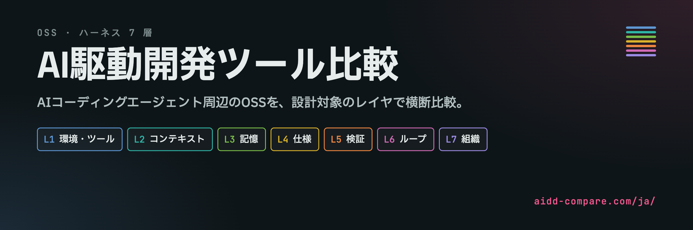

# AI駆動開発ツール比較

オープンソースのAI駆動開発ツールを7つのレイヤで整理した比較資料です。

各ツールが支援する工程、残す成果物、プロジェクトへの適合を比較できます。

[比較サイトを開く（aidd-compare.com）](https://aidd-compare.com/ja/) · [English](../README.md)

## はじめに

1. [比較サイト](https://aidd-compare.com/ja/)か[比較表](../docs/comparison.md)でツールを一覧します。
2. [選定ガイド](../docs/decision-guide.md)で課題を整理し、対応するレイヤを探します。
3. 各ツールの導入条件、プロジェクトへの適合、向かない用途を確認します。

## ドキュメント

詳細資料は英語です。

| 読む資料 | 分かること |
|---|---|
| [比較表](../docs/comparison.md) | 各ツールの役割と適用範囲 |
| [レイヤの説明](../docs/layers/README.md) | 実行環境、コンテキスト、記憶、仕様、検証、反復、協調の違い |
| [評価軸とデータの読み方](../docs/schema.md) | 各項目と値の意味 |
| [品質の評価基準](../docs/quality-rubric.md) | 評価に必要な根拠 |
| [作業フロー](../docs/flows.md) | ツールが定める作業の順序 |
| [掲載基準](../CRITERIA.md) | 比較に含めるツールの範囲 |

## レイヤモデル

| レイヤ | 設計するもの |
|---|---|
| L1 | エージェントの実行環境と使えるツール |
| L2 | 推論に渡すコンテキスト |
| L3 | ターンやセッションを越えて残す記憶 |
| L4 | 実装する変更の仕様 |
| L5 | 検証方法と完了条件 |
| L6 | 反復、フィードバック、停止条件 |
| L7 | 複数エージェントの役割分担と協調 |

## 評価軸

開発工程の支援範囲、プロジェクトへの適合、品質、トークン消費の傾向、保守状況、作業フロー、標準への対応を比較します。[評価軸とデータの読み方](../docs/schema.md)で各値の意味を確認できます。

## 比較方法

[ツール別データ](../data/tools/)には、出典、参照日、前提条件、向かない用途を記載しています。[フローの根拠](../data/flow-evidence/)では、各手順に対応する参照先を確認できます。

`none`は確認した結果の「なし」、`not-assessed`は「未確認」です。`conf: check`と`unresolved`は再確認が必要な評価を示します。トークン消費の分類は構造からの判断で、実測費用ではありません。スター数も品質の点数ではありません。

総合点や順位は付けていません。自分の課題に関係する項目を比較してください。出典の参照日は確認時点を示し、値が常に最新であることを意味しません。

誤りの指摘や掲載の提案は[CONTRIBUTING](../CONTRIBUTING.md)を参照してください。

独自に作成した資料とデータは[CC BY 4.0](../LICENSE)で公開しています。第三者の素材は対象外です。評価を引用する際は、版またはコミットと参照日の併記をおすすめします。
